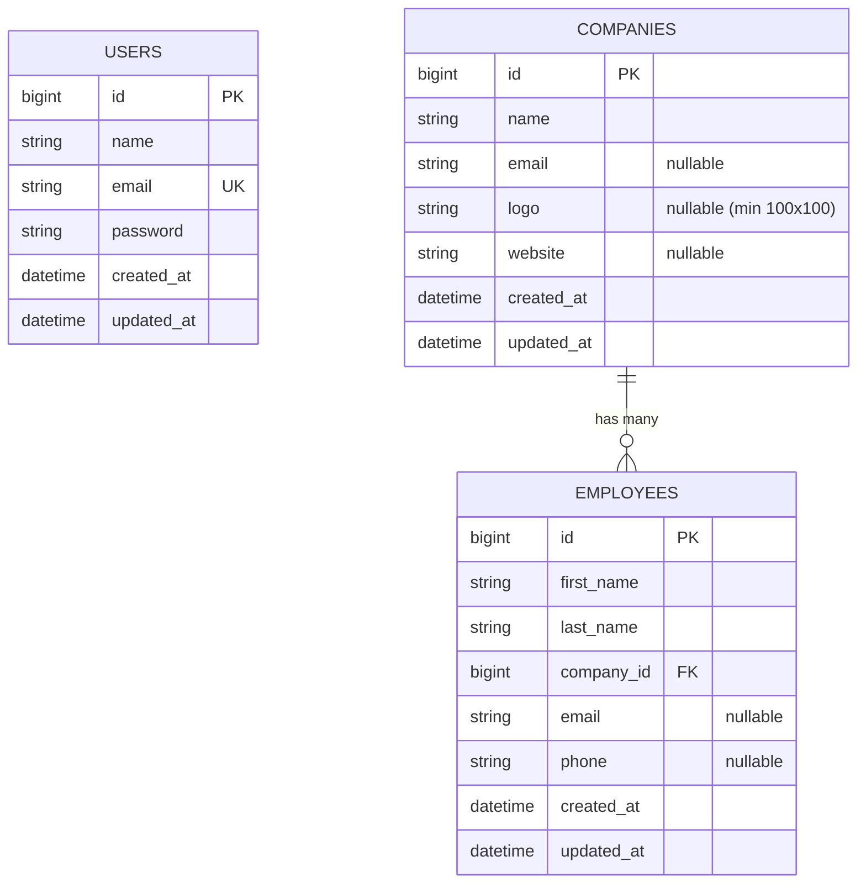

# Mini-CRM & Admin Management Panel

[](https://laravel.com)
[](https://php.net)
[](https://tailwindcss.com)
[](https://alpinejs.dev)

A modern, robust **Mini-CRM Web Application and Admin Panel** built with Laravel for managing companies and their respective employees.

---

## 📋 Table of Contents

- [Overview](#-overview)
- [Key Features & Assessment Compliance](#-key-features--assessment-compliance)
- [Tech Stack](#-tech-stack)
- [System Requirements](#-system-requirements)
- [Installation & Setup](#-installation--setup)
- [Default Admin Credentials](#-default-admin-credentials)
- [API Documentation](#-api-documentation)
- [Database Schema & Relationships](#-database-schema--relationships)
- [Directory Structure](#-directory-structure)
- [Testing & Verification](#-testing--verification)

---

## 🌟 Overview

This application serves as a centralized management platform for administrators to track corporate entities and their workforce. It features complete CRUD workflows, custom form request validations, file storage integration for logos, automated pagination, and a RESTful API endpoint for seamless external integrations.

---

## ✅ Key Features & Assessment Compliance

| Requirement | Implementation Detail |
| :--- | :--- |
| **Authentication** | Built with Laravel Breeze starter kit; administrator authentication enabled; public registration routes safely disabled. |
| **Database Seeder** | Pre-configured `DatabaseSeeder` automatically seeds the default administrator account. |
| **CRUD Modules** | Full Create, Read, Update, Delete functionality for both **Companies** and **Employees**. |
| **Companies Table** | Fields: `name` (required), `email` (nullable), `logo` (min 100×100px), `website` (nullable). |
| **Employees Table** | Fields: `first_name` (required), `last_name` (required), `company_id` (foreign key with `cascadeOnDelete`), `email` (nullable), `phone` (nullable). |
| **Database Migrations** | Strict database schemas with indexation and foreign key constraints. |
| **Logo Storage** | Uploaded logos stored in `storage/app/public/company-logos` and exposed via the `public` storage disk symlink. |
| **Validation** | Dedicated `FormRequest` classes (`StoreCompanyRequest`, `UpdateCompanyRequest`, `StoreEmployeeRequest`, `UpdateEmployeeRequest`) with dimension, MIME, and email format rules. |
| **Pagination** | Clean pagination displaying **10 entries per page** on both Companies and Employees index pages. |
| **Resource Controllers** | Standard Laravel RESTful resource controllers (`CompanyController`, `EmployeeController`). |
| **API Endpoint** | `GET /api/companies/{id}` returns company details with nested employee records and an appended `employee_count` attribute. |

---

## 🛠 Tech Stack

- **Backend Framework:** Laravel 13.x
- **Language:** PHP 8.3+
- **Frontend / UI:** Blade Templates, Tailwind CSS, Alpine.js
- **Database:** MySQL / MariaDB (or SQLite for local development)
- **Asset Bundler:** Vite

---

## ⚙️ System Requirements

- **PHP** >= 8.3 (with `pdo`, `mbstring`, `openssl`, `fileinfo`, `gd`/`imagick` extensions enabled)
- **Composer** >= 2.0
- **Node.js** >= 18.x & **NPM**
- **MySQL** >= 8.0 or **MariaDB** >= 10.4

---

## 🚀 Installation & Setup

Follow these steps to run the project locally:

### 1. Clone the Repository
```bash
git clone <repository-url>
cd fnxperts-crm
```

### 2. Install PHP & Node Dependencies
```bash
composer install
npm install
```

### 3. Environment Configuration
Copy the `.env.example` file to `.env`:
```bash
cp .env.example .env
```

Configure your database settings in `.env`:
```dotenv
DB_CONNECTION=mysql
DB_HOST=127.0.0.1
DB_PORT=3306
DB_DATABASE=your_database_name
DB_USERNAME=your_database_user
DB_PASSWORD=your_database_password
```

### 4. Generate Application Key
```bash
php artisan key:generate
```

### 5. Run Database Migrations & Seeds
Run the migrations along with the default database seeder:
```bash
php artisan migrate:fresh --seed
```

### 6. Create Storage Symlink
Link the `storage/app/public` directory to `public/storage` to enable public access for uploaded company logos:
```bash
php artisan storage:link
```

### 7. Compile Assets & Start the Development Server
In one terminal, compile frontend assets:
```bash
npm run dev
```

In another terminal, start the Laravel local server:
```bash
php artisan serve
```

The application will be accessible at `http://127.0.0.1:8000`.

---

## 🔑 Default Admin Credentials

Upon running `php artisan migrate:fresh --seed`, the initial administrator account is ready for use:

- **Login URL:** `http://127.0.0.1:8000/login`
- **Email:** `admin@admin.com`
- **Password:** `password`

*(Note: Registration is disabled by design per assessment specifications)*

---

## 📡 API Documentation

### Get Single Company with Employees & Count

Returns detailed information about a single company, all associated employees, and the dynamic `employee_count`.

- **Endpoint:** `GET /api/companies/{id}`
- **Headers:**
  ```http
  Accept: application/json
  ```

#### Example cURL Request:
```bash
curl -X GET "http://127.0.0.1:8000/api/companies/2" \
     -H "Accept: application/json"
```

#### Example Response (`200 OK`):
```json
{
  "data": {
    "id": 2,
    "name": "FNXperts",
    "email": "info@example.com",
    "logo": "company-logos/example-logo.jpg",
    "website": "https://www.example.com/",
    "employee_count": 2,
    "employees": [
      {
        "id": 1,
        "first_name": "John",
        "last_name": "Doe",
        "email": "john.doe@example.com",
        "phone": "+1234567890"
      },
      {
        "id": 2,
        "first_name": "Jane",
        "last_name": "Smith",
        "email": "jane.smith@example.com",
        "phone": "+1987654321"
      }
    ]
  }
}
```

#### Postman Testing:
1. Open Postman and create a new `GET` request.
2. Enter the request URL: `http://127.0.0.1:8000/api/companies/2`
3. Under the **Headers** tab, add `Accept: application/json`.
4. Click **Send** to verify the response payload.

---

## 🗄 Database Schema & Relationships



### Validation Rules Summary:

- **Company Validation (`StoreCompanyRequest` / `UpdateCompanyRequest`):**
  - `name`: Required, String, Max 255
  - `email`: Nullable, Valid Email Address format
  - `logo`: Nullable, Image (`jpg`, `jpeg`, `png`, `webp`), Minimum dimensions **100×100 px**, Max 2MB
  - `website`: Nullable, Valid URL format
- **Employee Validation (`StoreEmployeeRequest` / `UpdateEmployeeRequest`):**
  - `first_name`: Required, String, Max 255
  - `last_name`: Required, String, Max 255
  - `company_id`: Required, Exists in `companies,id`
  - `email`: Nullable, Valid Email Address format
  - `phone`: Nullable, String (custom phone validation supported)

---

## 📁 Directory Structure

```text
fnxperts-crm/
├── app/
│   ├── Http/
│   │   ├── Controllers/
│   │   │   ├── Api/
│   │   │   │   └── CompanyController.php      # API Endpoint Controller
│   │   │   ├── CompanyController.php          # Web Resource Controller (Companies)
│   │   │   ├── EmployeeController.php         # Web Resource Controller (Employees)
│   │   │   └── DashboardController.php        # Dashboard Metrics
│   │   ├── Requests/
│   │   │   ├── StoreCompanyRequest.php        # Company Store Validation
│   │   │   ├── UpdateCompanyRequest.php       # Company Update Validation
│   │   │   ├── StoreEmployeeRequest.php       # Employee Store Validation
│   │   │   └── UpdateEmployeeRequest.php      # Employee Update Validation
│   │   └── Resources/
│   │       └── CompanyResource.php            # JSON API Transformation Resource
│   └── Models/
│       ├── Company.php                        # Company Eloquent Model & Relations
│       ├── Employee.php                       # Employee Eloquent Model & Relations
│       └── User.php                           # Administrator Model
├── database/
│   ├── migrations/                            # Database Schema Migrations
│   └── seeders/
│       └── DatabaseSeeder.php                 # Default Admin Account Seeder
├── resources/
│   └── views/
│       ├── companies/                         # Company CRUD Views (Index, Create, Edit, Show)
│       ├── employees/                         # Employee CRUD Views (Index, Create, Edit, Show)
│       ├── layouts/                           # Application Layouts & Sidebar
│       └── components/                        # UI Components (Modals, Alerts)
├── routes/
│   ├── api.php                                # API Routes (/api/companies/{company})
│   ├── auth.php                               # Auth Routes (Registration disabled)
│   └── web.php                                # Web Resource Routes & Dashboard
└── storage/
    └── app/
        └── public/
            └── company-logos/                 # Uploaded Company Logos
```

---

## 🧪 Testing & Verification

### Running PHPUnit / Pest Tests (if applicable):
```bash
php artisan test
```

### Manual Quality Checklist:
- [x] Admin login with `admin@admin.com` / `password`.
- [x] Public registration is disabled and returns 404 / inaccessible.
- [x] Create, Read, Update, Delete operations for Companies.
- [x] Uploading logos smaller than 100×100px triggers a validation error.
- [x] Logos are saved to `storage/app/public/company-logos` and displayed correctly.
- [x] Create, Read, Update, Delete operations for Employees linked to Companies.
- [x] Pagination shows 10 items per page on both Companies and Employees lists.
- [x] `GET /api/companies/{id}` returns the company with `employee_count` and the list of employees.
